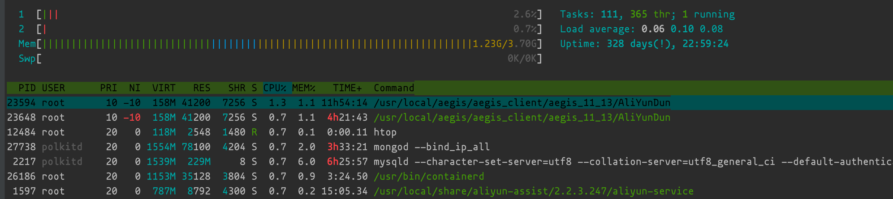
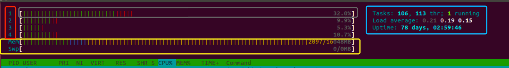
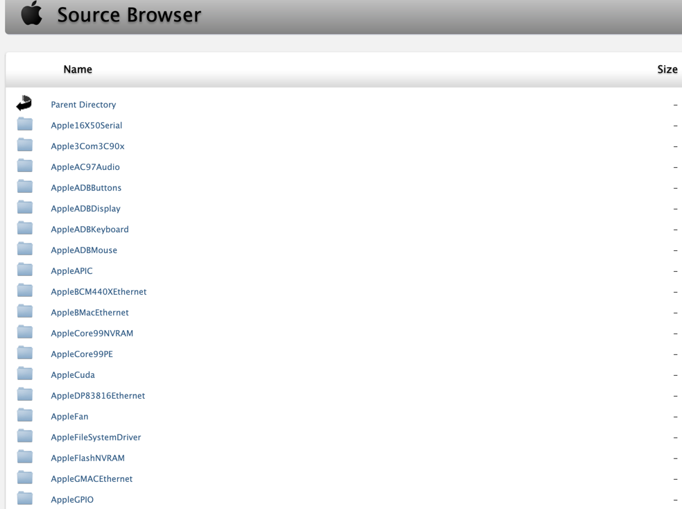

# htop 命令



htop是linux系统中的一个互动的进程查看器，一个文本模式的应用程序(在控制台或者X终端中)，需要ncurses。

htop比较人性化。它可让用户交互式操作，支持颜色主题，可横向或纵向滚动浏览进程列表，并支持鼠标操作。

htop相比较top的优势有可以横向或纵向滚动浏览进程列表，以便看到所有的进程和完整的命令行、在启动上比top更快、杀进程时不需要输入进程号、支持鼠标选中操作、top已不再维护。

> ### linux man 手册缩影

```shell
$ man htop
HTOP(1)                                                                                   Utils                                                                                   HTOP(1)

NAME
       htop - interactive process viewer

SYNOPSIS
       htop [-dChustv]

DESCRIPTION
       Htop is a free (GPL) ncurses-based process viewer for Linux.

       It  is  similar to top, but allows you to scroll vertically and horizontally, so you can see all the processes running on the system, along with their full command lines, as well
       as viewing them as a process tree, selecting multiple processes and acting on them all at once.

       Tasks related to processes (killing, renicing) can be done without entering their PIDs
       .....     
```

**htop是top的升级版,允许用户监视系统上运行的进程及其完整的命令行**

系统不会自带，若是Ubuntu，sudo apt, 若是 Centos， yum 可以安装。根据不过系统来进行安装 支持用户交互，可以通过鼠标来kill进程而不用通过输入其PID，支持用鼠标上下拖动，且不同的颜色代表不同的意思。
允许用户根据CPU，内存和时间间隔对进程进行排序

## htop 的安装

**Ubuntu 安装**

```shell
$ sudo apt install htop
```

**Centos 安装**

```shell
$ yum -y install epel-release
$ yum -y update && yum install -y htop
```

## 使用简介

**语法格式：htop [参数]**

常用参数：

```
-C	使用单色配色方案
-d	设置更新的延迟， 单位是10微秒
-s	纵列排序
-u	只显示一个指定用户的进程
-p	只显示给用户
-h	打印此命令帮助
-v	打印版本信息
```

交互式命令：

```
space	标记一个进程
U	取消所有标记
l	显示进程打来的文件
u	显示特定用户
M	按照内存排序
P	按照CPU排序
T	按在线时长排序
直接输入数字	查找对应的PID进程
```

> 用例参考

简单启动 htop (常用)

```shell
[root@linuxcool ~]# htop # 按 q 退出
```

以单色(黑白)模式启动htop：

```shell
[root@linuxcool ~]# htop -C
```

设置显示更新的延迟为3秒：

```shell
[root@linuxcool ~]# htop -d 3
```

显示一个指定 用户 的进程：

```shell
[root@linuxcool ~]# htop -u www

  1  [|||                                                                              2.1%]   Tasks: 111, 365 thr; 1 running
  2  [||                                                                               1.2%]   Load average: 0.07 0.06 0.05 
  Mem[||||||||||||||||||||||||||||||||||||||||||||||||||||||||||||||||||||||||||1.23G/3.70G]   Uptime: 328 days(!), 22:47:28
  Swp[                                                                                0K/0K]

  PID USER      PRI  NI  VIRT   RES   SHR S CPU% MEM%   TIME+  Command
17073 www        20   0 96956 37160  2760 S  0.0  1.0  0:54.64 nginx: worker process
17074 www        20   0 96956 31384  2192 S  0.0  0.8  1:32.83 nginx: worker process
31441 www        20   0  651M 18044  8148 S  0.0  0.5  0:01.91 php-fpm: pool www
31442 www        20   0  648M 15404  6448 S  0.0  0.4  0:01.81 php-fpm: pool www
31443 www        20   0  648M 17204  8084 S  0.0  0.4  0:01.77 php-fpm: pool www
31444 www        20   0  648M 17824  8712 S  0.0  0.5  0:01.78 php-fpm: pool www
```

显示一个指定PID(s) 的进程： 
```shell
[root@linuxcool ~]# htop -p `pgrep -d , 'php-fpm|nginx'`
  1  [|                                                                                0.7%]   Tasks: 111, 366 thr; 1 running
  2  [||||                                                                             2.6%]   Load average: 0.06 0.05 0.05 
  Mem[||||||||||||||||||||||||||||||||||||||||||||||||||||||||||||||||||||||||||1.23G/3.70G]   Uptime: 328 days(!), 22:45:33
  Swp[                                                                                0K/0K]

  PID USER      PRI  NI  VIRT   RES   SHR S CPU% MEM%   TIME+  Command
17073 www        20   0 96956 37160  2760 S  0.0  1.0  0:54.64 nginx: worker process
17074 www        20   0 96956 31384  2192 S  0.0  0.8  1:32.83 nginx: worker process
27232 root       20   0 67260  9436   884 S  0.0  0.2  0:00.18 nginx: master process /usr/local/openresty/nginx/sbin/nginx -c /usr/local/openresty/nginx/conf/nginx.conf
31431 root       20   0  647M 16072  7620 S  0.0  0.4 21:16.16 php-fpm: master process (/usr/local/php/etc/php-fpm.conf)
31441 www        20   0  651M 18044  8148 S  0.0  0.5  0:01.91 php-fpm: pool www
31442 www        20   0  648M 15404  6448 S  0.0  0.4  0:01.81 php-fpm: pool www
31443 www        20   0  648M 17204  8084 S  0.0  0.4  0:01.77 php-fpm: pool www
31444 www        20   0  648M 17824  8712 S  0.0  0.5  0:01.78 php-fpm: pool www
31445 www        20   0  648M 16788  7796 S  0.0  0.4  0:01.76 php-fpm: pool www

```

显示对应进程带树状关系缩进：
```shell
[root@linuxcool ~]# htop -t -p `pgrep -d , 'php-fpm|nginx'`
  1  [||||                                                                             2.6%]   Tasks: 114, 365 thr; 1 running
  2  [|||                                                                              2.6%]   Load average: 0.06 0.05 0.05 
  Mem[||||||||||||||||||||||||||||||||||||||||||||||||||||||||||||||||||||||||||1.23G/3.70G]   Uptime: 328 days(!), 22:44:46
  Swp[                                                                                0K/0K]

  PID USER      PRI  NI  VIRT   RES   SHR S CPU% MEM%   TIME+  Command
31431 root       20   0  647M 16072  7620 S  0.0  0.4 21:16.16 ├─ php-fpm: master process (/usr/local/php/etc/php-fpm.conf)
31470 www        20   0  651M 16764  6900 S  0.0  0.4  0:01.81 │  ├─ php-fpm: pool www
31469 www        20   0  648M 16348  7344 S  0.0  0.4  0:01.73 │  ├─ php-fpm: pool www
31468 www        20   0  648M 16060  7072 S  0.0  0.4  0:01.82 │  ├─ php-fpm: pool www
31467 www        20   0  651M 17264  7356 S  0.0  0.4  0:01.80 │  ├─ php-fpm: pool www
31466 www        20   0  648M 16484  7452 S  0.0  0.4  0:01.82 │  ├─ php-fpm: pool www
31465 www        20   0  651M 17544  7620 S  0.0  0.5  0:01.79 │  ├─ php-fpm: pool www
31464 www        20   0  648M 15672  6716 S  0.0  0.4  0:01.79 │  ├─ php-fpm: pool www
31463 www        20   0  651M 17332  7428 S  0.0  0.4  0:01.79 │  ├─ php-fpm: pool www
31462 www        20   0  651M 16300  6376 S  0.0  0.4  0:01.82 │  ├─ php-fpm: pool www
```

> 以上涉及的 辅助命令

**pgrep**
```
pgrep : 进程PID查找命令

语法格式：pgrep [options] pattern

pgrep -d ,       # 以逗号分隔
pgrep pattern    # 进程CMD 正则 
pgrep -d , 'xxx' # 查找对应 CMD进程的 PID 多个以逗号分隔
```

**CMD 信息举例**
```shell
# CMD 举例(ps 显示的最后一列)
[root@localhost ~]# ps -efa
UID        PID  PPID  C STIME TTY          TIME CMD
root         1     0  0  2020 ?        01:25:21 /usr/lib/systemd/systemd --switched-root --system --deserialize 22
root         2     0  0  2020 ?        00:00:05 [kthreadd]
root         4     2  0  2020 ?        00:00:00 [kworker/0:0H 
```


### 基本的概念

tasks/process 进程， thread 线程相关的知识可以从下面的链接学习

[如何理解：程序、进程、线程、并发、并行、高并发]](https://www.zhihu.com/question/307100151/answer/894486042)

[宇宙之一粟：为什么校招面试中“线程与进程的区别”老是被问到?我该如何回答？](https://zhuanlan.zhihu.com/p/125716637)

[Difference between Process and Thread - GeeksforGeeks](https://www.geeksforgeeks.org/difference-between-process-and-thread/)



**红色边框**

数字1，2，3，4分别代表CPU处理器/核，上图是一个四核的处理器

**灰色边框（progress bar）**

每一个CPU的总用量情况，注意这条上面会有不同的颜色：
```
蓝色：显示低优先级(low priority)进程使用的CPU百分比。
绿色：显示用于普通用户(user)拥有的进程的CPU百分比。
红色：显示系统进程(kernel threads)使用的CPU百分比。
橙色：显示IRQ时间使用的CPU百分比。
洋红色(Magenta)：显示Soft IRQ时间消耗的CPU百分比。
灰色：显示IO等待时间消耗的CPU百分比。
青色：显示窃取时间(Steal time)消耗的CPU百分比。
```

**黄色边框**

提供了内存（Memory）和交换（Swap）使用情况。 类似于CPU中的进度条，内存监视也包含具有多种颜色的进度条：
```
绿色：显示内存页面占用的RAM百分比
蓝色：显示缓冲区页面占用的RAM百分比
橙色：显示缓存页面占用的RAM百分比
```


**蓝色边框**

***第一行 (Tasks, thr, running)***

参考上面的屏幕截图,我们在计算机上运行的106个任务(tasks)被分解为113个线程(thread)，其中只有1个进程处于运行(running)状态。
任务(tasks)是打开的进程总数的代表，但并不是每个打开的进程都在不断消耗CPU。 每个进程都处于几种状态
```YAML
R: Running,表示进程(process)正在使用CPU
S: Sleeping,通常进程在大多数时间都处于睡眠状态，并以固定的时间间隔执行小检查，或者等待用户输入后再返回运行状态。
T/S: Traced/Stoped,表示进程正在处于暂停的状态
Z: Zombie or defunct,已完成执行但在进程表中仍具有条目的进程。
```

***第二行 Load Average***

三个值是指系统在 最近1分钟, 最近5分钟 和 最近15分钟 的平均负载 (0.21,0.19,0.15)

系统负载（System Load）是系统CPU繁忙程度的度量，即有多少进程在等待被CPU调度（进程等待队列的长度）。

平均负载（Load Average）是一段时间内系统的平均负载，这个一段时间一般取1分钟、5分钟、15分钟。

> Load Average值的含义：

- 1、单核处理器（例如：1个1核cpu）

   假设我们的系统是单CPU单内核的，把它比喻成是一条单向马路，把CPU任务比作汽车。

   当车不多的时候，load <1；

   当车占满整个马路的时候 load=1；

   当马路都站满了，而且马路外还堆满了汽车的时候，load>1


- 2、多核处理器（例如：2个cpu或一个2核的cpu）

   我们经常会发现服务器Load > 1但是运行仍然不错，那是因为服务器是多核处理器（Multi-core）。

   假设我们服务器一个CPU是2 核，那么将意味我们拥有2条马路，我们的Load = 2时，所有马路都跑满车辆。
   
   Load 最大值以此类推

> 系统负载趋势判断:

总结: [ 就是 画 (x:横坐标)时间「 x 起点为 近15分钟 」, (y:纵坐标) 「 y 起点为 近15平均负载 」平均负载 折线图(趋势图) ] 

```
1分钟Load>1，5分钟Load<1，15分钟Load<1：短期内繁忙，中长期空闲，初步判断是一个“抖动”，或者是“拥塞前兆” 

1分钟Load>1，5分钟Load>1，15分钟Load<1：短期内繁忙，中期内紧张，很可能是一个“拥塞的开始”

1分钟Load>1，5分钟Load>1，15分钟Load>1：短、中、长期都繁忙，系统“正在拥塞”

1分钟Load<1，5分钟Load>1，15分钟Load>1：短期内空闲，中、长期繁忙，不用紧张，系统“拥塞正在好转”
```

***第三行 Uptime***

表示这个系统一共运行了多长的时间，这里一共运行了78天

**下半部分**
```
PID – 描述进程的ID号
USER – 描述进程的所有者（谁跑的）
PRI – 描述Linux内核查看的进程优先级
NI – 描述由用户或root重置的进程优先级
VIR – 它描述进程正在使用的虚拟内存 （virtual memory）
RES – 描述进程正在消耗的物理内存（physical memory）
SHR – 描述进程正在使用的共享内存（shared memory）
S – 描述流程的当前状态 (state)
CPU％ – 描述每个进程消耗的CPU百分比
MEM％ – 描述每个进程消耗的内存百分比
TIME+ – 显示自流程开始执行以来的时间
Command –它与每个进程并行显示完整的命令执行 (比如/usr/lib/R)
```

## 扩展知识:

***相似的 Linux 命令有:***
```
top  #  实时显示进程动态
glances # 高层次的多子系统概览
```


> Linux CPU 信息查看 

**查看cpu信息命令:**
```shell
$ cat /proc/cpuinfo  
```

**查看cpu总核心数命令:**
```shell
$ grep 'model name' /proc/cpuinfo | wc -l  
```

或
```shell
$ grep -c 'model name' /proc/cpuinfo 
```

>  MacOs CPU 信息查看

**查看 CPU 信息**

```shell
➜  sysctl -n machdep.cpu.brand_string # 查看CPU 商标(品牌)
➜  sysctl -n machdep.cpu.core_count # 查看CPU 核心数
➜  sysctl -h machdep.cpu # 人性化(key:value)显示CPU 新列表
```

[Apple 开源代码站点](https://opensource.apple.com/source/)



> 参考来源

[linuxcool-htop命令](https://www.linuxcool.com/htop)

[知乎-Linux htop 详解](https://zhuanlan.zhihu.com/p/296803907)

[csdn-Linux 平均负载 Load Average 详解](https://blog.csdn.net/weixin_30808693/article/details/99239273)