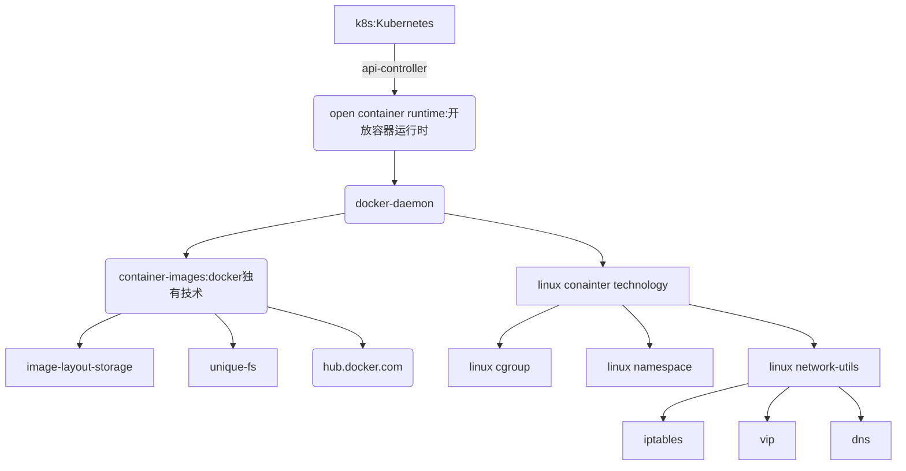
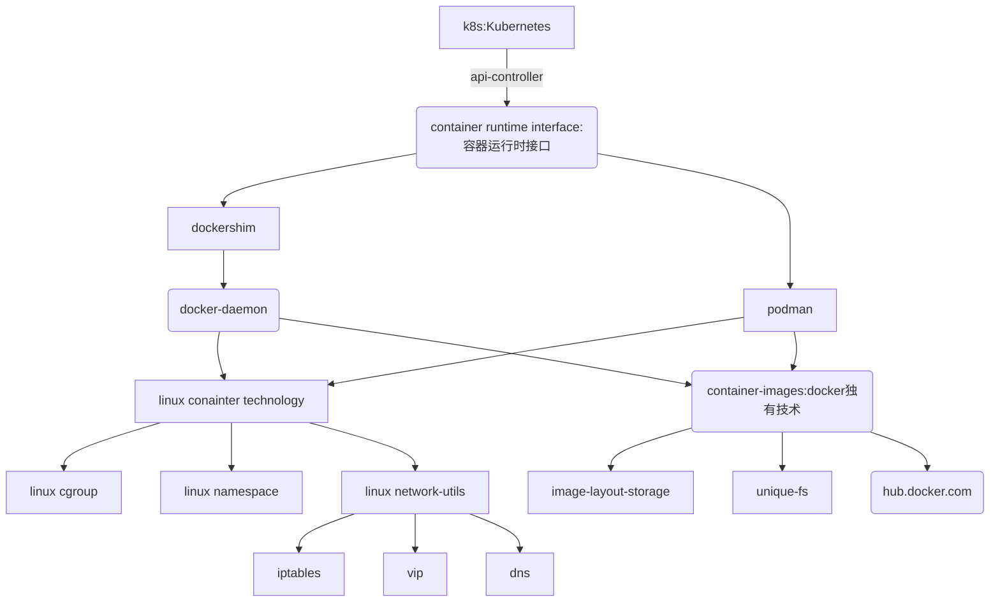

# k8s 环境安装

> ## k8s 架构

1.20 之前：

```mermaid
 graph TD
    k8s[k8s:Kubernetes] -->|api-controller| OCR(open container runtime:开放容器运行时)
    
    OCR-->docker(docker-daemon)
   
    docker--> container[linux conainter technology]
    
    docker--> container-images(container-images:docker独有技术)
    
    container-images --> image-layout-storage
    container-images --> unique-fs
    container-images --> image-repository(hub.docker.com)
    
    container[linux conainter technology] --> cgroup[linux cgroup]
    container[linux conainter technology] --> namespace[linux namespace]
    container[linux conainter technology] --> network-utils[linux network-utils]
    
    network-utils[linux network-utils] --> iptables
    network-utils[linux network-utils] --> vip
    network-utils[linux network-utils] --> dns
```

1.20 之后: 

```mermaid
 graph TD
    k8s[k8s:Kubernetes] -->|api-controller| CRI(container runtime interface:容器运行时接口)
    
    CRI-->dockershim
    CRI-->podman
    
    dockershim-->docker(docker-daemon)
    
    podman--> container[linux conainter technology]
    docker--> container[linux conainter technology]
    
    docker--> container-images(container-images:docker独有技术)
    podman--> container-images(container-images:docker独有技术)
    
    container-images --> image-layout-storage
    container-images --> unique-fs
    container-images --> image-repository(hub.docker.com)
    
    container[linux conainter technology] --> cgroup[linux cgroup]
    container[linux conainter technology] --> namespace[linux namespace]
    container[linux conainter technology] --> network-utils[linux network-utils]
    
    network-utils[linux network-utils] --> iptables
    network-utils[linux network-utils] --> vip
    network-utils[linux network-utils] --> dns
```

> ## 学习环境安装 

学习 环境安装效果 重在 : 快速, 简单, 功能全

学习 环境安装 分 3步:
### docker (CRI: container runtime interface) 安装

### kubectl 安装

### kind 安装