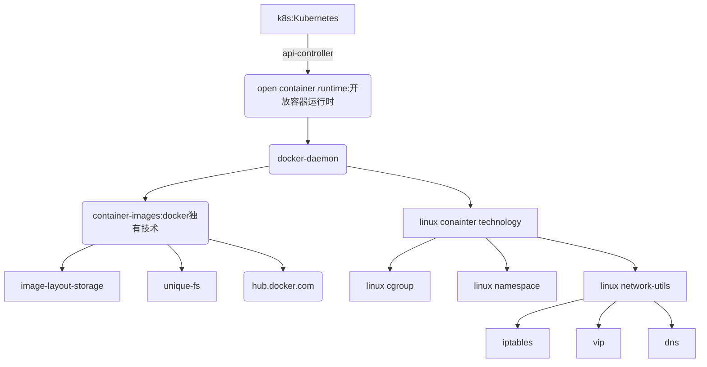
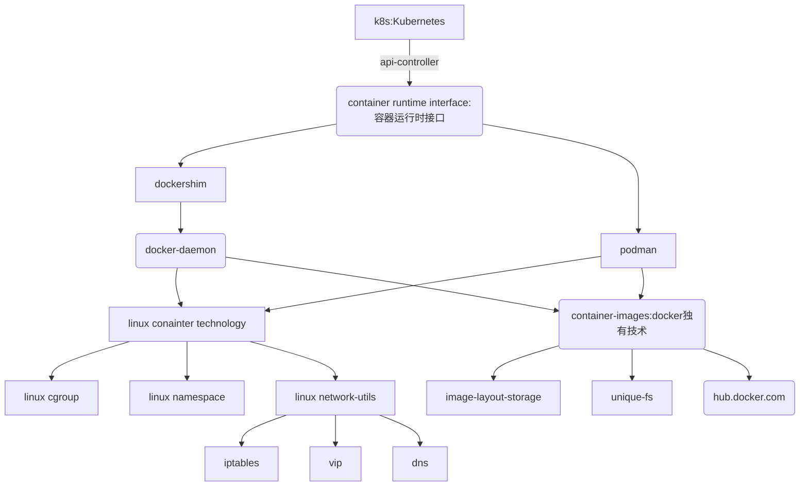

# k8s 环境安装

> ## k8s 架构

1.20 之前：


1.20 之后: 


> ## 学习环境安装 

学习 环境安装效果 重在 : 快速, 简单, 功能全

[Kubernetes 安装学习文档](https://kubernetes.io/docs/tasks/tools/)

学习 环境安装 分 3步:
### docker (CRI: container runtime interface) 安装

 - linux 安装 

 - macOS 安装

 - windows 安装

### kubectl 安装

 - macOS 安装
 ```bash
$ curl -LO "https://dl.k8s.io/release/$(curl -L -s https://dl.k8s.io/release/stable.txt)/bin/darwin/amd64/kubectl"
$ chmod +x ./kubectl
$ sudo mv ./kubectl /usr/local/bin/kubectl
$ sudo chown root: /usr/local/bin/kubectl
 ```

### kind 安装

```bash
$ curl -Lo ./kind https://kind.sigs.k8s.io/dl/v0.11.1/kind-darwin-amd64
$ chmod +x ./kind
$ mv ./kind /usr/local/bin/kind
```

编程 集群启动配置文件 kind-cluster.yaml (YAML) 

```yaml
kind: Cluster
apiVersion: kind.x-k8s.io/v1alpha4
name: kind-cluster
nodes:
  - role: control-plane
  - role: worker
  - role: worker
  - role: worker

```

## kubectl 插件安装

```bash
(
  set -x; cd "$(mktemp -d)" &&
  OS="$(uname | tr '[:upper:]' '[:lower:]')" &&
  ARCH="$(uname -m | sed -e 's/x86_64/amd64/' -e 's/\(arm\)\(64\)\?.*/\1\2/' -e 's/aarch64$/arm64/')" &&
  KREW="krew-${OS}_${ARCH}" &&
  curl -fsSLO "https://github.com/kubernetes-sigs/krew/releases/latest/download/${KREW}.tar.gz" &&
  tar zxvf "${KREW}.tar.gz" &&
  su chmod +x "${KREW}" &&  su  ./"${KREW}" install krew
)
```

kubectx
```bash
sudo mkdir -p $HOME/workpaces/coding/golang/src/github.com/ahmetb
sudo git clone https://github.com/ahmetb/kubectx $HOME/workpaces/coding/golang/src/github.com/ahmetb/kubectx

cd $HOME/workpaces/coding/golang/src/github.com/ahmetb/kubectx/cmd/kubectx && sudo go build
cd $HOME/workpaces/coding/golang/src/github.com/ahmetb/kubectx/cmd/kubens && sudo go build

sudo mv $HOME/workpaces/coding/golang/src/github.com/ahmetb/kubectx/cmd/kubectx/kubectx /usr/local/bin/kubectx
sudo mv $HOME/workpaces/coding/golang/src/github.com/ahmetb/kubectx/cmd/kubens/kubens /usr/local/bin/kubens
```